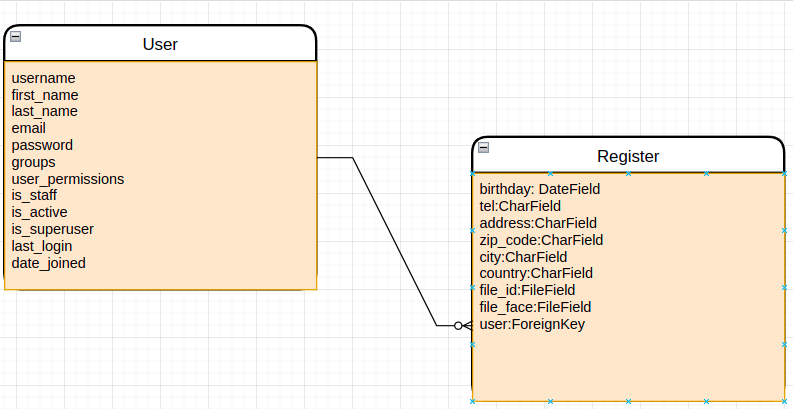

# DjangoChallenge
## install
### Postgresql
```
docker pull postgres
```

```
docker run --rm --name pegasus -e POSTGRES_PASSWORD=123456 -d -p 5432:5432 -v pgvolume:/var/lib/postgresql/data postgres
```

### Postgresql
```
docker pull dpage/pgadmin4
```
```
docker run -p 80:80 --name pg4 -e 'PGADMIN_DEFAULT_EMAIL=user@domain.com' -e 'PGADMIN_DEFAULT_PASSWORD=123456' -d dpage/pgadmin4
```

### Django
```
python3 manage.py  runserver
```

